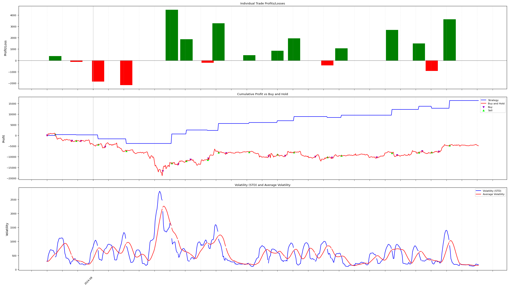

# Trading Strategy Backtester and Live Trader

## Overview

This Python program implements a versatile trading strategy tool that can function as both a backtester and a live trader. It focuses on cryptocurrency trading, allowing users to test strategies against historical data or execute trades in real-time using live market data from Kraken.


*Hourly bars from 2024-07-27 to 2024-08-27. 23.8% gain in a time when BTC dropped 6.86%, with 64.7% of all trades being profitable.*

## Features

- Custom trading strategy implementation (Tholonic Strategy)
- Dual mode operation:
  - Backtesting using historical price data
  - Live trading using real-time data from Kraken
- Support for multiple trading pairs
- Configurable parameters via command-line arguments
- Profit and loss tracking
- Performance visualization
  - Individual trade profits/losses
  - Cumulative profit over time compared to buy-and-hold strategy
  - Volatility and average volatility over time
- Profitability summary including:
  - Total number of trades
  - Number of profitable and non-profitable trades
  - Profit ratio
  - Total profit and profit percentage
  - Buy-and-hold return comparison

## Requirements

- Python 3.7+
- pandas
- numpy
- ccxt
- colorama
- matplotlib

## Installation

1. Clone this repository:
```sh
git clone https://github.com/yourusername/trading-strategy-tool.git cd trading-strategy-tool
```
2. Install the required packages:
```sh
pip install -r requirements.txt
```
## Usage

You can run the program using command-line arguments to set various parameters:
```sh
python trade_bot.py [options]
```
### Options:

- `-h, --help`: Show help message and exit
- `-p PAIR, --pair=PAIR`: Trading pair (default: BTCUSD)
- `-b, --livemode`: Run in live mode (default: backtest mode - livemode not yet enabled)
- `-m MAX, --max-positions=MAX`: Maximum number of positions (default: 2)
- `-n THRESHOLD, --negotiation=THRESHOLD`: Negotiation threshold (default: 1.0)
- `-l MULTIPLIER, --limitation=MULTIPLIER`: Limitation multiplier (default: 1.5)
- `-c THRESHOLD, --contribution=THRESHOLD`: Contribution threshold (default: 1.2)
- `-k PERIOD, --lookback=PERIOD`: Lookback period (default: 16)
- `-r RATE, --commission=RATE`: Commission rate (default: 0.001 = 0.1%)
- `-s PERCENTAGE, --stop-loss=PERCENTAGE`: Stop loss percentage (default: 1%)
- `-i BALANCE, --initial-balance=BALANCE`: Initial balance for buy-and-hold comparison (default: 1000)
- `-v LEVEL, --verbosity=LEVEL`: Verbosity level (default: 0)
- `-R RANGE, --daterange=RANGE`: Date range in format "YYYY-MM-DD|YYYY-MM-DD" or "YYYY-MM-DD|now"
- `-F FILE, --ohlcfile=FILE`: OHLCV file (default: data/BTCUSD_OHLC_1440_default.csv)
- `-L COUNT, --limitcount=COUNT`: Limit count (default: 720)

### Verbosity levels:
- 0: No screen output
- 1: Profitability summary
- 2: Profitability summary + detailed trading info
- 3: Profitability summary + detailed trading info + plot
- 101: Compact summary for batch processing

### Examples:

1. Run in backtest mode for BTCUSD with default settings:
```sh
python trade_bot.py -p BTCUSD
```
2. Run backtest for ETHUSD with custom settings:
```sh
python trade_bot.py -p ETHUSD -m 3 -n 1.2 -l 1.8 -c 1.5 -k 30 -r 0.002 -s 3 -v 2
```
3. Run backtest with date range and all parameters specified:
```sh
python trade_bot.py -p BTCUSD -m 2 -n 1.0 -l 1.5 -c 1.2 -k 20 -r 0.001 -s 1 -i 1000 -v 3 -R "2024-01-01|2024-06-30" -F data/BTCUSD_OHLC_60.csv
```
## Data Handling

- In backtest mode, the program reads historical data from CSV files in the `data/` directory. The file should be named according to the trading pair and timeframe, e.g., `BTCUSD_OHLC_60.csv` for hourly data.
- In live mode, it fetches real-time data from Kraken using the CCXT library.
- images are saved in the `/img` folder.
## Visualization

The program generates a plot with three subplots:

1. Individual trade profits/losses: A bar chart showing the profit or loss for each trade.
2. Cumulative profit vs Buy and Hold: A line chart comparing the strategy's cumulative profit to a buy-and-hold approach.
3. Volatility and Average Volatility: A line chart showing the asset's volatility and average volatility over time.

This visualization helps in understanding the strategy's performance in the context of market movements.

## Customization

You can customize the trading strategy by modifying the `TholonicStrategy` class in the source code. The main components to focus on are:

- `calculate_indicators()`: Define the indicators used by your strategy.
- `generate_signals()`: Implement the logic for generating buy and sell signals.

## Utility Scriptsm etc.
- krun2.sh - wrapper to run the bot for all pairs in one go.
- get_data.py - to get the data from kraken and save it in the data folder.
- get_live_data.py - to get the data from kraken using the ccxt library.
- krakenpairs.txt - list of all the pairs to run the bot for.

## Disclaimer

This program is for educational and research purposes only. It is not intended to be used as financial advice or a recommendation for any investment strategy. Always do your own research and consider seeking advice from a licensed financial advisor before making any investment decisions. When using the live trading mode, be aware of the risks involved in trading cryptocurrencies.

## Contributing

Contributions to improve the trading strategy tool are welcome. Please feel free to submit a Pull Request.

## License

This project is open-source and available under the MIT License.

This updated README reflects the changes in the code, including:

1. Updated command-line options and their default values
2. New features like stop loss and date range specification
3. Changes in the visualization (removal of price delta plot, addition of volatility plot)
4. More detailed examples of how to run the script
5. Updated description of the verbosity levels, including the new level 101 for batch processing

# Notes:

Legend of abbreviation that _might_ be used:

- n = negotiation threshold
- l = limitation multiplier
- c = contribution threshold
- k = lookback_period
- TT = Total Trades
- PT = Profitable Trades
- PN = Non-Profitable Trades:
- PR: Profit Ratio
- IC = Initial Capital (1st buy)
- FS = Final Selling Price
- TP = Total Profit
- BH = Buy-and-Hold Return
- FC = Final Capital
- TR = Total Return
- TH = Total Units Held at End
- CP = Compare P total profit % over buy and hold %
- AV = Avg Volume


Examples:

```sh
# Get the data from Kraken (XBT is what Kraken calls BTC).
# This is saved automatically as `data/XBT_USDT_OHLC_60_20240727_20240827.csv`
./get_data.py -c XBT -b USD -f 2024-07-27 -t 2024-08-27 -i 60
# Process it. `-v 101` shows only the final result, writes the CSV file
#   and plots the results to file only.
# Use `-v 3` to see all the details and plots.
# The n, l, c, k, s values are optimum for 1 hour charts.
# The '-p XBT_USDT' is optional and only for information on the output.
#   If not specified, it will default to "XBT_USD."
./trade_bot.py -p XBT_USDT  -v 101  -n 0.5 -l 0.3 -c 1.4 -k 15  -F data/XBT_USDT_OHLC_60_20240727_20240827.csv -s 4.8 -m 1 -R "2024-07-27|2024-08-27"

# Example for SOL/USD
./get_data.py -c SOL -b USD -f 2024-07-27 -t 2024-08-26 -i 60
./trade_bot.py -v 101  -n 0.5 -l 0.3 -c 1.4 -k 15  -F data/ETH_USD_OHLC_60_20240727_20240826.csv -s 4.8 -m 1 -R "2024-07-27|2024-08-30"

# The output, when using '-v 101' looks somethign like this:
n:0.50l:0.30c:1.40k:15s:4.80|2024-07-27 00:00:00 - 2024-08-30 16:56:35|TT:   19|PN:   7/ 12|PR: 36.84%|TP: $  121.28 (  4.99%)|FC: $ 3326.28|TR: $  3.78%|FL: $ 3205.00/ 2743.81
```

